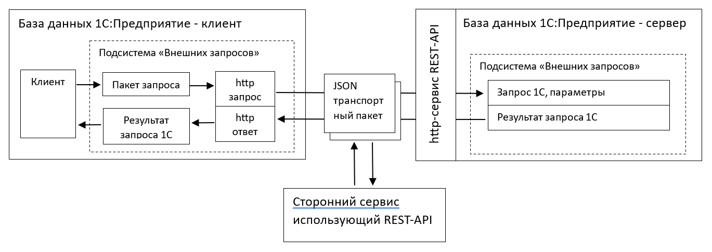
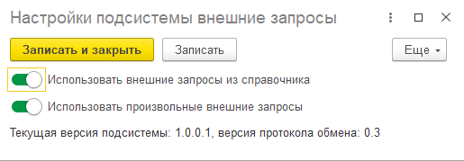
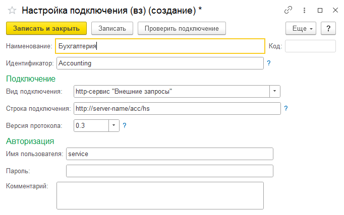
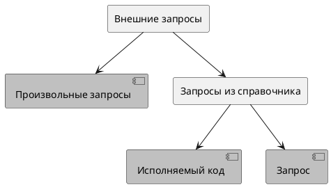
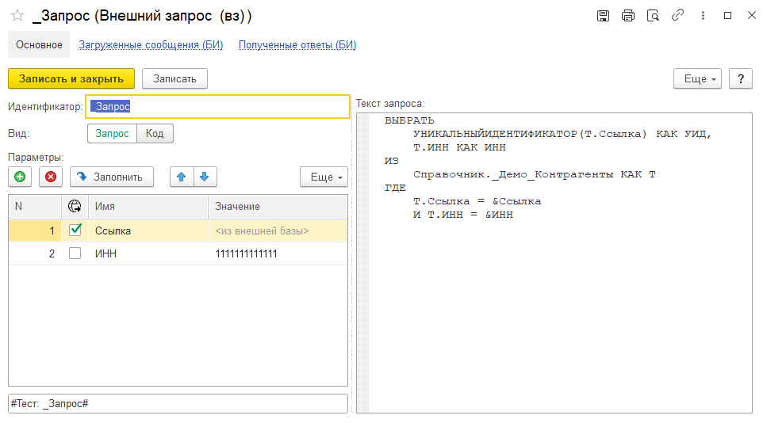
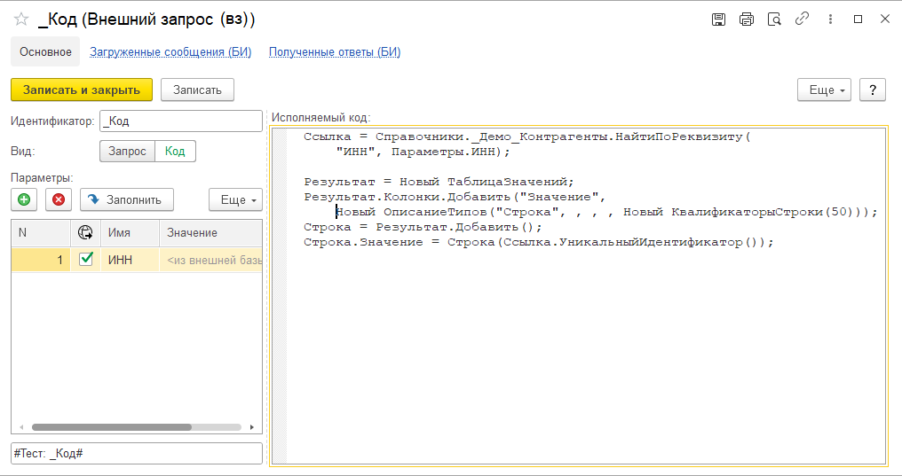

# Подсистема "Внешних запросов"

Версия подсистемы: 1.0.0.1

Версия протокола: 0.3

Обмен реализован по методологии REST с использованием формата JSON.

Оглавление

- [Подсистема "Внешних запросов"](#подсистема-внешних-запросов)
  - [Введение](#введение)
  - [Описание подсистемы 1С](#описание-подсистемы-1с)
    - [Форма "Настройки"](#форма-настройки)
    - [Справочник "Настройки подключения"](#справочник-настройки-подключения)
    - [Получение параметров подключения](#получение-параметров-подключения)
    - [Создание пакета запроса](#создание-пакета-запроса)
      - [Произвольный запрос](#произвольный-запрос)
      - [Запрос из справочника](#запрос-из-справочника)
    - [Установка параметров](#установка-параметров)
      - [Примитивные типы параметров](#примитивные-типы-параметров)
      - [Ссылочные типы параметров](#ссылочные-типы-параметров)
      - [Произвольные типы параметров](#произвольные-типы-параметров)
      - [Ссылочные параметры с произвольным поиском](#ссылочные-параметры-с-произвольным-поиском)
      - [Массивы параметров](#массивы-параметров)
    - [Отправка запроса в сервис](#отправка-запроса-в-сервис)
    - [Обработка результатов](#обработка-результатов)
    - [Пример использования 1](#пример-использования-1)
    - [Пример использования 2](#пример-использования-2)
    - [Пример использования 3](#пример-использования-3)
  - [Описание протокола передачи данных JSON](#описание-протокола-передачи-данных-json)
    - [Тест работы сервиса](#тест-работы-сервиса)
    - [Транспортный пакет](#транспортный-пакет)
    - [Отправка запроса в http-сервис](#отправка-запроса-в-http-сервис)
      - [Структура JSON объекта "Параметр запроса"](#структура-json-объекта-параметр-запроса)
      - [Структура JSON объекта "Контейнер параметра запроса"](#структура-json-объекта-контейнер-параметра-запроса)
        - [Контейнер примитивного типа данных](#контейнер-примитивного-типа-данных)
        - [Контейнер ссылочного типа данных](#контейнер-ссылочного-типа-данных)
        - [Вид объекта "Справочник"](#вид-объекта-справочник)
        - [Вид объекта "Документ"](#вид-объекта-документ)
        - [Вид объекта "Перечисление"](#вид-объекта-перечисление)
        - [Вид объекта "ПланВидовХарактеристик"](#вид-объекта-планвидовхарактеристик)
        - [Вид объекта "ПланСчетов"](#вид-объекта-плансчетов)
      - [Пример текста JSON "Пакета запроса"](#пример-текста-json-пакета-запроса)
    - [Ответ http-сервиса на запрос](#ответ-http-сервиса-на-запрос)

## Введение

Подсистема "Внешних запросов" позволяет получать результаты запроса 1С:Предприятие выполненного во внешней базе данных, опубликованной через http-сервис в локальной сети или в глобальной сети интернет. Подключение может выполняться из любой системы поддерживающей REST-API.

Общая схема работы подсистемы



Получить информацию про версию подсистемы "Внешних запросов" из 1C:Предприятие можно в форме [Настроек (вз)](#форма-настройки).

Получить версию из сторонних систем можно выполнив http-запрос [проверки подключения](#тест-работы-сервиса).

## Описание подсистемы 1С

Подсистема внешних запросов оперирует внутренними стандартизированными объектами для уменьшения ошибок пользователя системы. Основным используемым объектом является ["ПакетЗапроса"](#создание-пакета-запроса), который далее отправляется в http-сервис внешней базы данных. Настройки подсистемы хранятся в общей форме ["Настройки (вз)"](#форма-настройки). Описание настроек подключения к внешней базе данных содержится в справочнике ["Настройки подключения (вз)"](#справочник-настройки-подключения).

Для настройки подсистемы на серверной стороне требуется:

- Включить [настройки](#форма-настройки) использования внешних запросов.
- Заполнить справочник [Внешние запросы (вз)](#запрос-из-справочника), если предполагается его использование.
- Сделать публикацию http-сервиса серверной базы.

Для настройки подсистемы на клиентской стороне требуется:

- Создать элемент справочника ["Настройки подкючения (вз)"](#справочник-настройки-подключения).

Для получения результата выполнения запроса во внешней базе требуется выполнить шаги:

- Получить [параметры подключения](#получение-параметров-подключения).
- [Создать пакет запроса](#создание-пакета-запроса)
- [Добавить параметры запроса](#установка-параметров)
- [Отправить запрос](#отправка-запроса-в-сервис)

Далее требуется выполнить обработку результатов запроса.

### Форма "Настройки"

Содержит настройки подсистемы внешних запросов. Предоставляет возможность включать отдельные части подсистемы. Открыть форму можно перейдя по пути: подсистема "Внешние запросы" -> Сервис -> Настройки подсистемы внешние запросы.

Пример окна настроек:



### Справочник "Настройки подключения"

Заполняется в клиентской базе. Содержит описание настроек публикации серверных баз данных, заполнение полей настроек интуитивно понятно.

Пример заполнения:



### Получение параметров подключения

Перед созданием пакета запроса требуется создать "Параметры подключения" - структура параметров формируемая на основании справочника "Настройки подключения (вз)" с помощью метода `ПолучитьПараметрыПодключения()`. Данный метод принимает на вход только "Идентификатор настройки подключения".

Пример:

```bsl
ПараметрыПодключения = вз_ВнешниеЗапросыИсходящие.ПолучитьПараметрыПодключения("AccQuery");
```

### Создание пакета запроса

В подсистеме реализованы следующие разновидности внешних запросов:



> Все виды запросов на клиентской стороне принимают [параметры](#установка-параметров), которые затем можно использовать на серверной стороне.

#### Произвольный запрос

Серверная база будет выполнять запрос, только если в [настройках](#форма-настройки) включена константа "Использовать произвольные внешние запросы", в противном случае серверная база вернет исключение.

> В произвольных запросах текст запроса передается из клиентской базы в серверную и выполняется там.

Для создания пакета запроса требуется вызвать метод `вз_ВнешниеЗапросыИсходящие.СоздатьПакетПроизвольногоЗапроса()`

Метод принимает параметры:

- `ПараметрыПодключения` - Структура - [Параметры подключения](#получение-параметров-подключения).
- `ТекстЗапроса` - Строка - Текст запроса, который будет выполнен во внешней базе.

Метод возвращает Структуру пакета запроса - это внутренный объект наполняемый методами подсистемы, который в последствии будет отправлен в http-сервис.

Пример:

```bsl
ПараметрыПодключения = вз_ВнешниеЗапросыИсходящие.ПолучитьПараметрыПодключения("AccQuery");
ПакетЗапроса = вз_ВнешниеЗапросыИсходящие.СоздатьПакетПроизвольногоЗапроса(ПараметрыПодключения, ТекстЗапроса);
Результат = вз_ВнешниеЗапросыИсходящие.ОтправитьЗапрос(ПараметрыПодключения, ПакетЗапроса);
```

#### Запрос из справочника

Серверная база будет выполнять запрос, только если в [настройках](#форма-настройки) включена константа "Использовать внешние запросы из справочника", в противном случае серверная база вернет исключение.

> В данном виде запросов текст выполняемого запроса хранится в справочнике "Внешние запросы (вз)" серверной базы.

Элемент справочника может быть двух видов: `Код`, `Запрос`. На клиентской стороне нет возможности контролировать или получать вид запроса, это определяется видом элемента справочника в серверной базе.

Для создания пакета запроса требуется вызвать метод `вз_ВнешниеЗапросыИсходящие.СоздатьПакетЗапросаИзСправочника()`

Метод принимает параметры:

- `ПараметрыПодключения` - Структура - [Настройки подключения](#получение-параметров-подключения).
- `ИдентификаторЗапроса` - Строка - Идентификатор запроса из справочника внешних запросов, который хранится во внешней базе.

Метод возвращает Структуру пакета запроса - это внутренный объект наполняемый методами подсистемы, который в последствии будет отправлен в http-сервис.

Пример:

```bsl
ПараметрыПодключения = вз_ВнешниеЗапросыИсходящие.ПолучитьПараметрыПодключения("AccQuery");
ПакетЗапроса = вз_ВнешниеЗапросыИсходящие.СоздатьПакетЗапросаИзСправочника(ПараметрыПодключения, "ВзаиморасчетыПоПодотчетнымЛицам");
Результат = вз_ВнешниеЗапросыИсходящие.ОтправитьЗапрос(ПараметрыПодключения, ПакетЗапроса);
```

Элемент справочника с видом `Запрос` представлен на картинке ниже.



Элемент справочника с видом `Код` представлен на картинке ниже.



### Установка параметров

Установка параметров внешнего запроса делается через вызов методов, которые выбираются в зависимости от типа данных устанавливаемого параметра:

- [Примитивные типы данных](#примитивные-типы-параметров)
- [Массивы](#массивы-параметров)
- [Ссылочные типы данных](#ссылочные-типы-параметров)

#### Примитивные типы параметров

Для добавления параметров примитивного типа данных требуется вызвать процедуру: `ДобавитьПараметрПримитивногоТипа()`, которая принимает параметры:

- Пакет - Структура - Пакет для отправки в http-сервис, созданный методом [СоздатьПакетЗапроса()](#создание-пакета-запроса)
- ИмяПараметра - Строка - Имя параметра запроса
- Значение - Строка, Число, Дата, Булево - Значение параметра запроса

Пример:

```BSL
вз_ВнешниеЗапросыИсходящие.ДобавитьПараметрПримитивногоТипа(ПакетЗапроса, "УчитыватьОстатки", Истина);
вз_ВнешниеЗапросыИсходящие.ДобавитьПараметрПримитивногоТипа(ПакетЗапроса, "ПредставлениеНачалаПериода", "Остатки на начало периода");
вз_ВнешниеЗапросыИсходящие.ДобавитьПараметрПримитивногоТипа(ПакетЗапроса, "Коэффициент", 3.15);
вз_ВнешниеЗапросыИсходящие.ДобавитьПараметрПримитивногоТипа(ПакетЗапроса, "НачалоПериода", ТекущаяДатаСеанса());
```

#### Ссылочные типы параметров

Для добавления параметров ссылочного типа требуется вызвать одну из процедур: `ДобавитьПараметрПеречисление()`, `ДобавитьПараметрСправочник()`, `ДобавитьПараметрДокумент()`, `ДобавитьПараметрПВХ()`, `ДобавитьПараметрПланСчетов()`.
  
Пример:  

```BSL  
вз_ВнешниеЗапросыИсходящие.ДобавитьПараметрСправочник(ПакетЗапроса, "Поставщик", "Контрагенты", Контрагент, "Ссылка-Код", Ложь);
```

#### Произвольные типы параметров

Произвольные параметры рекомендуется использовать, когда в базе инициирующей внешний запрос нет типа данных устанавливаемого параметра запроса.

Для добавления параметров произвольного типа требуется вызвать функцию: `СоздатьПараметрСсылочногоТипа()`, которая возвращает контейнер параметра и установить этот контейнер в список параметров методом `ДобавитьПараметр()`.
  
Пример:  

```BSL  
Параметр = вз_ВнешниеЗапросыИсходящие.СоздатьПараметрСсылочногоТипа("Справочник.Контрагенты", "Ссылка", СтрокаУникальныйИдентификатор);
вз_ВнешниеЗапросыИсходящие.ДобавитьПараметр(Пакет, "ИмяПараметра", Параметр);
```

#### Ссылочные параметры с произвольным поиском

Параметры с произвольным поиском используюутся, когда ни один из стандартных способов поиска ссылки во внешней базе не подходит (такие как "Ссылка", "Код", "Наименование", "ПредопределенноеИмя", "Номер", "Дата" и их комбинации).

Для добавления параметров произвольного типа требуется:

1. Вызвать методы: `СоздатьПараметрСправочник()`, `СоздатьПараметрДокумент()`, `СоздатьПараметрПВХ()`, `СоздатьПараметрПланСчетов()`, `СоздатьПараметрСсылочногоТипа()`
2. При вызове установить параметр `МетодПоиска` в значение `"Произвольный"`
3. При вызове установить параметр `ИсполняемыйКодПоиска` строкой программного кода, которы будет исполняться при поиске ссылки во внешней базе
4. Опционально при вызове установить параметр `ПараметрыПоиска` - Структура, Массив, Соответствие - вспомогательная коллекция примитивных значений, которая будет передана во внешнюю базу и будет доступна при выполнении программного кода `ИсполняемыйКодПоиска`

При исполнении кода во внешней базе доступны переменные:

- Значение - Ссылка - результат поиска ссылки
- Параметры - Структура, Массив, Соответствие - ПараметрыПоиска, переданные в метод при создании параметра с произвольным поиском.

**ВНИМАНИЕ! В целях безопасности при исполнении программного кода `ИсполняемыйКодПоиска`, который может быть исполнен при поиске параметра с произвольным поиском, настоятельно рекомендуется создавать отдельного пользователя базы данных 1С, у которого есть права только на чтение требуемых объектов базы данных!**

Пример:  

```BSL
ИсполняемыйКод = "Значение = Справочники.Контрагенты.НайтиПоКоду(Параметры.Код)";

Параметр = вз_ВнешниеЗапросыИсходящие.СоздатьПараметрСсылочногоТипа("Справочник.Контрагенты", "Произвольный", , , , , , , ИсполняемыйКод);
вз_ВнешниеЗапросыИсходящие.ДобавитьПараметр(Пакет, "Ссылка", Параметр);
```

Пример:  

```BSL
ПараметрыПоиска = Новый Структура;
ПараметрыПоиска.Вставить("Код", "000000001");
ПараметрыПоиска.Вставить("Наименование", "Наименование объекта");

ИсполняемыйКод = 
    "Значение = Справочники.Контрагенты.НайтиПоКоду(Параметры.Код);
    |Если НЕ ЗначениеЗаполнено(Значение) Тогда
    |   Значение = Справочники.Контрагенты.НайтиПоНаименованию(Параметры.Наименование); 
    |КонецЕсли;";

Параметр = вз_ВнешниеЗапросыИсходящие.СоздатьПараметрСсылочногоТипа("Справочник.Контрагенты", "Произвольный", , , , , , , ИсполняемыйКод, ПараметрыПоиска);
вз_ВнешниеЗапросыИсходящие.ДобавитьПараметр(Пакет, "Ссылка", Параметр);
```

#### Массивы параметров

Для добавления массива (списка) параметров запроса нужно:

1. Создать обычный массив 1С.
2. Наполнить его контейнерами параметров. Для этого предусмотрен блок функций: `ДобавитьПараметрПримитивногоТипа()`, `СоздатьПараметрПеречисление()`, `СоздатьПараметрСправочник()`, `СоздатьПараметрДокумент()`, `СоздатьПараметрПВХ()`, `СоздатьПараметрПланСчетов()`, `СоздатьПараметрСсылочногоТипа()`
3. Вызвать метод `ДобавитьПараметр()`, который добавляет параметр в список параметров "Пакета запроса".

Пример:

```BSL
Массив = Новый Массив;
Массив.Добавить(вз_ВнешниеЗапросыИсходящие.СоздатьПараметрСправочник("СтатьиДвиженияДенежныхСредств", Значение, "Ссылка-Код"));
вз_ВнешниеЗапросыИсходящие.ДобавитьПараметр(ПакетЗапроса, "СтатьиДДС", Массив);
```

### Отправка запроса в сервис

Для отправки запроса во внешнюю базу нужно вызвать метод `вз_ВнешниеЗапросыИсходящие.ОтправитьЗапрос()`, который принимает на вход следующие аргументы:

- ПараметрыПодключения - Структура - Настройки подключения полученные методом `ПолучитьПараметрыПодключения()`
- Пакет - Структура - Структура запроса полученный методом `СоздатьПакетЗапроса()`
- РезультатВВидеТаблицыЗначений - Булево - Если установлено, то результат из поля "Данные" будет преобразован в таблицу значений, иначе будет возвращен массив структур.

В результате исполнения внешнего запроса будет возвращена структура 1С со следуюущими полями:

- Отказ - Булево - флаг наличия ошибок при выполнении запроса
- ОписаниеОшибки - Строка - информация об ошибке, в случае Отказ=Истина
- Данные - Массив - массив структур данных, сериализованная таблица значений результата выполнения запроса

Пример:

```BSL
Результат = вз_ВнешниеЗапросыИсходящие.ОтправитьЗапрос(ПараметрыПодключения, ПакетЗапроса, Истина);
```

### Обработка результатов

Результатом выполнения запроса во внешней базе является структура с полями:

- Версия - Строка - версия протокола обмена поддерживаемого подсистемой ВнешниеЗапросы внешней базы данных.
- Отказ - Булево - флаг отказа при выполнении запроса
- ОписаниеОшибки - Строка - описание отказ, если взведен флаг Отказ
- Данные - Массив, таблицаЗначений - результат выполнения запроса во внешней базе данных

Реквизит Данные может быть следующих типов:

- Массив Структур - массив содержащий в элементах структуры данных с одинаковыми полями. При передаче из внешней базы в исходную таблица значений полученная из результата запроса 1С сериализуется в массив структур. Для получения данных в виде массива структур необходимо при вызове функции `ОтправитьЗапрос(ПараметрыПодключения, Пакет, РезультатВВидеТаблицыЗначений)` установить аргумент РезультатВВидеТаблицыЗначений в значение `Ложь` или не заполнять (будет использовано значение по-умолчанию).

- ТаблицаЗначений - таблица с результатами выполнения запроса. Поcле получения результата запроса на стороне текущей базы производится преобразование массива структур в таблицу значений с одновременным динамическим вычислением типов колонок. Для получения данных в виде таблицы значений необходимо при вызове функции `ОтправитьЗапрос(ПараметрыПодключения, Пакет, РезультатВВидеТаблицыЗначений)` установить аргумент РезультатВВидеТаблицыЗначений в значение `Истина`.

Типы данных колонок результирующего запроса **ограничены** только следующими сериализуемыми типами:

- Примитивные типы (Булево, Строка, Число, Дата)
- УникальныйИдентификатор (начиная с версии платформы 8.3.22 в запросе можно получить методом `УникальныйИдентификатор(Ссылка)`)
- ТипЗначения (автоматически приводится к строке)

При указании других типов данных колонок результирующего запроса будет вызвано исключение во внешней базе, в результате вернется структура с флагом `Отказ=Истина` и описанием исключения в поле `ОписаниеОшибки`.

Для удобства использования добавлены вспомогательные методы:

- метод `вз_ВнешниеЗапросы.ПолучитьСсылку(Менеджер, СтрокаУИД)` возвращающий ссылку на объект текущей базы данных по `УникальномуИдентификатору`.
- метод `вз_ВнешниеЗапросы.ПолучитьКешСсылок(ИмяМетаданных, МассивСтрокУИД)` возвращающий кеш-соответствие строк УникальныхИдентификаторов и ссылок на объекты текущей базы данных. Метод получает все данные одним запросом. Обязательное условие - все уникальные идентификаторы должны быть одного типа.

Вызовы методов также показаны в примерах ниже.

Пример:

```BSL
Результат = вз_ВнешниеЗапросыИсходящие.ОтправитьЗапрос(ПараметрыПодключения, Пакет, Истина);

Если Результат.Отказ Тогда
    Текст = СтрШаблон("Ошибка выполнения запроса во внешней базе данных: %1", Результат.ОписаниеОшибки);
    вз_ВнешниеЗапросы.ЗаписатьВЖурнал(Текст, УровеньЖурналаРегистрации.Ошибка);
    ВызватьИсключение Текст;
КонецЕсли;

КешКонтрагентов = Результат.Данные.ВыгрузитьКолонку("Справочник.Контрагенты", "КонтрагентУИД");

Для каждого Строка Из Результат.Данные Цикл
    Контрагент = КешКонтрагентов.Получить(Строка.КонтрагентУИД);
КонецЦикла;
```

### Пример использования 1

```BSL
ПараметрыПодключения = вз_ВнешниеЗапросыИсходящие.ПолучитьПараметрыПодключения("USOQuery"); 
Пакет = вз_ВнешниеЗапросыИсходящие.СоздатьПакетПроизвольногоЗапроса(ПараметрыПодключения, ТекстЗапроса);
вз_ВнешниеЗапросыИсходящие.ДобавитьПараметрДата(Пакет, "НачалоПериода", НачалоПериода);
вз_ВнешниеЗапросыИсходящие.ДобавитьПараметрДата(Пакет, "КонецПериода", КонецПериода);

// Отправим запрос
Результат = вз_ВнешниеЗапросыИсходящие.ОтправитьЗапрос(ПараметрыПодключения, Пакет);
Если НЕ Результат.Отказ Тогда
    Для каждого Строка Из Результат.Данные Цикл    
        // Обработка результатов ...
        // Строка - Структура - строка таблицы значений результата запроса из внешней базы    
    КонецЦикла;    
КонецЕсли;
```

### Пример использования 2

```BSL
ПараметрыПодключения = вз_ВнешниеЗапросыИсходящие.ПолучитьПараметрыПодключения("USOQuery");
Пакет = вз_ВнешниеЗапросыИсходящие.СоздатьПакетПроизвольногоЗапроса(ПараметрыПодключения, ТекстЗапроса);
вз_ВнешниеЗапросыИсходящие.ДобавитьПараметрПримитивногоТипа(Пакет, "НачалоПериода", НачалоПериода);
вз_ВнешниеЗапросыИсходящие.ДобавитьПараметрПримитивногоТипа(Пакет, "КонецПериода", КонецПериода);
вз_ВнешниеЗапросыИсходящие.СоздатьПараметрПВХ("ВидыСубконтоХозрасчетные", ВидСубконто, "ПредопределенноеИмя");

// Добавим списочный параметр Контрагент
Массив = Новый Массив;
Массив.Добавить(вз_ВнешниеЗапросыИсходящие.СоздатьПараметрСправочник("Контрагенты", Контрагент1));
Массив.Добавить(вз_ВнешниеЗапросыИсходящие.СоздатьПараметрСправочник("Контрагенты", Контрагент2, "Ссылка-Код"));
вз_ВнешниеЗапросыИсходящие.ДобавитьПараметр(Пакет, "Контрагент", Массив);

// Отправим запрос
Результат = вз_ВнешниеЗапросыИсходящие.ОтправитьЗапрос(ПараметрыПодключения, Пакет, Истина);
Если Результат.Отказ Тогда
    Текст = СтрШаблон("Ошибка выполнения запроса во внешней базе данных: %1", Результат.ОписаниеОшибки);
    вз_ВнешниеЗапросы.ЗаписатьВЖурнал(Текст, УровеньЖурналаРегистрации.Ошибка);
    ВызватьИсключение Текст;
КонецЕсли;

// Обработка результатов
Для каждого Строка Из Результат.Данные Цикл
    // Обработка результатов ...
    // Строка - СтрокаТаблицыЗначений - строка результата запроса из внешней базы
КонецЦикла;
```

### Пример использования 3

```BSL
ПараметрыПодключения = вз_ВнешниеЗапросыИсходящие.ПолучитьПараметрыПодключения("USOQuery");
Пакет = вз_ВнешниеЗапросыИсходящие.СоздатьПакетЗапросаИзСправочника(ПараметрыПодключения, "ДанныеДоговоров");

// Отправим запрос
Результат = вз_ВнешниеЗапросыИсходящие.ОтправитьЗапрос(ПараметрыПодключения, Пакет, Истина);

// Обработка результатов...
```

## Описание протокола передачи данных JSON

После публикации базы данных доступ к http-сервису внешних запросов можно получить по URL адресу:

```http://server-name/base-name/hs/remote-query/{method}```

, где:

- server-name - имя сервера, где опубликована база
- base-name - имя базы
- hs - идентификатор http-сервиса
- remote-query - имя корневого URL http-сервиса внешних запросов
- {method} - имя метода для работы с внешними запросами

Доступны следующие методы:

- [ping](#тест-работы-сервиса) - тест работы сервиса
- [get](#отправка-пакета-внешнего-запроса) - получение данных внешнего запроса

### Тест работы сервиса

Проверить работу сервиса можно по URL:

```http://server-name/base-name/hs/remote-query/ping```

> Для быстрого тестирования данный URL можно указать в адресной строке браузера

В ответ сервис должен вернуть строку данных:

```txt
"Successful connection!
Subsystem version 1.0.0.1
Protocol version 0.3
```

### Транспортный пакет

Все данные (кроме теста работы сервиса) упаковываются в транспортные пакеты следующего формата:

| Ключ             | Обязательный | Тип значения | Описание                      |
| :--------------- | :----------- | :----------- | :---------------------------- |
| ver              | +            | Строка       | Номер версии протокола        |
| sender           | +            | Строка       | Отправитель запроса для логов |
| user             | +            | Строка       | Пользователь для логов        |
| error            | +            | Строка       | JSON Объект "Данные"          |
| ErrorDescription | +            | Строка       | Описание ошибки               |
| contentType      | +            | Строка       | Тип содержимого[1]            |
| content          | +            | Строка       | Содержимое                    |

[1] Тип содержимого, может принимать значения:

- custom - произвольный запрос
- fromСatalog - запрос из справочника
- result - результат запроса

### Отправка запроса в http-сервис

Получить результат выполнения запроса можно по URL:

```http://server-name/base-name/hs/remote-query/get```

Для этого нужно отправить http-запрос методом GET в теле запроса указать текст JSON [Транспортного пакета запроса](#транспортный-пакет) со структурой поля `content`:

| Ключ      | Обязательный | Тип значения | Описание                                                      |
| :-------- | :----------- | :----------- | :------------------------------------------------------------ |
| queryText | +            | Строка       | Текст запроса `1С:Предприятие` для выполнения во внешней базе |
| params    |              | JSON массив  | Массив JSON объектов "Параметр запроса"                       |

#### Структура JSON объекта "Параметр запроса"

| Ключ  | Обязательный | Тип значения             | Описание                                                 |
| :---- | :----------- | :----------------------- | :------------------------------------------------------- |
| name  | +            | Строка                   | Имя параметра запроса                                    |
| value | +            | JSON объект, JSON массив | JSON массив или JSON объект "Контейнер значения запроса" |

#### Структура JSON объекта "Контейнер параметра запроса"

Контейнеры параметров запроса могут содержать различные типы данных, тип данных контейнера указан в параметре "type". Данный параметр может принимать значения примитивных типов "bool", "string", "double", "date" или значение ссылочного типа "ref".

##### Контейнер примитивного типа данных

| Ключ  | Обязательный | Тип значения          | Описание                                         |
| :---- | :----------- | :-------------------- | :----------------------------------------------- |
| type  | +            | Строка                | Тип значения: "bool", "string", "double", "date" |
| value | +            | Строка, Булево, Число | Значение параметра примитивного типа [1]         |

[1]: Значение параметра примитивного типа, ограничено в зависимости от значения type, таблица ограничений указана ниже.

| type   | Ограничение value                        | Пример              |
| :----- | :--------------------------------------- | :------------------ |
| bool   | Булево (принимает значения: true, false) | true                |
| string | Строка                                   | "Какая-то строка"   |
| double | Число                                    | 1,125               |
| date   | Дата в формате `"yyyy-mm-ddThh:MM:ss"`   | 2023-05-04T09:36:05 |

##### Контейнер ссылочного типа данных

Значение ссылочного типа данных обязательно уточняется в параметре "objectType", который принимает следующий значения:

- [Справочник](#вид-объекта-справочник).<ИмяСправочника>
- [Документ](#вид-объекта-документ).<ИмяДокумента>
- [Перечисление](#вид-объекта-перечисление).<ИмяПеречисления>
- [ПланВидовХарактеристик](#вид-объекта-планвидовхарактеристик).<ИмяПВХ>
- [ПланСчетов](#вид-объекта-плансчетов).<ИмяПланаСчетов>

Еще одним обязательным параметром является "serchingMethod", который определяет метод поиска ссылки в базе данных и принимает следующие значения:

- "reference" - поиск по ссылке
- "reference-code" - поиск по ссылке, если не найден, то по коду
- "reference-code-name" - поиск по ссылке, если не найден, то по коду, затем наименованию
- "code" - поиск по коду
- "name" - поиск по наименованию с точным соответствием
- "predefinedName" - поиск по предопределенному имени
- "custom" - произвольный, выполняется код поиска указанный в параметре `customCode`
- "reference-custom" - поиск по уникальному идентификатору, если не найден выполняется код поиска указанный в параметре `customCode`

Список допустимых значений различается у каждого вида объекта, список указан в колонке "Описание" в таблице ниже.

##### Вид объекта "Справочник"

| Ключ            | Обязательный | Тип значения                            | Описание                                                                                                                                                                  |
| :-------------- | :----------- | :-------------------------------------- | :------------------------------------------------------------------------------------------------------------------------------------------------------------------------ |
| type            | +            | Строка                                  | Тип значения: "ref"                                                                                                                                                       |
| objectType      | +            | Строка                                  | Тип объекта во внешней базе, например: "Справочник.Контрагенты"                                                                                                           |
| serchingMethod  | +            | Строка                                  | Метод поиска ссылочного параметра во внешней базе, доступны: "reference", "reference-code", "reference-code-name", "code", "predefinedName", "custom", "reference-custom" |
| ref             |              | Строка                                  | UUID ссылочного объекта во внешней базе                                                                                                                                   |
| code            |              | Строка                                  | Код объекта                                                                                                                                                               |
| name            |              | Строка                                  | Наименование объекта                                                                                                                                                      |
| predefinedName  |              | Строка                                  | Предопределенное имя объекта                                                                                                                                              |
| customCode      |              | Строка                                  | Произвольный код выполняемый во внешней базе для поиска ссылки на объект                                                                                                  |
| customParams    |              | bool, string, double, date, JSON объект | Параметры используемые при произвольном поиске ссылки на объект [2]                                                                                                       |
| giveSearchError |              | Булево                                  | В случае, если не найдено значение во внешней базе будет выдано исключение                                                                                                |

##### Вид объекта "Документ"

| Ключ            | Обязательный | Тип значения                            | Описание                                                                                                                                       |
| :-------------- | :----------- | :-------------------------------------- | :--------------------------------------------------------------------------------------------------------------------------------------------- |
| type            | +            | Строка                                  | Тип значения: "ref"                                                                                                                            |
| objectType      | +            | Строка                                  | Тип объекта во внешней базе, например: "Документ.Заказ"                                                                                        |
| serchingMethod  | +            | Строка                                  | Метод поиска ссылочного параметра во внешней базе, доступны: "reference", "reference-number-date", "number-date", "custom", "reference-custom" |
| ref             |              | Строка                                  | UUID ссылочного объекта во внешней базе                                                                                                        |
| number          |              | Строка                                  | Номер документа                                                                                                                                |
| date            |              | Дата                                    | Дата документа                                                                                                                                 |
| customCode      |              | Строка                                  | Произвольный код выполняемый во внешней базе для поиска ссылки на объект                                                                       |
| customParams    |              | bool, string, double, date, JSON объект | Параметры используемые при произвольном поиске ссылки на объект [2]                                                                            |
| giveSearchError |              | Булево                                  | В случае, если не найдено значение во внешней базе будет выдано исключение                                                                     |

##### Вид объекта "Перечисление"

| Ключ            | Обязательный | Тип значения | Описание                                                                      |
| :-------------- | :----------- | :----------- | :---------------------------------------------------------------------------- |
| type            | +            | Строка       | Тип значения: "ref"                                                           |
| objectType      | +            | Строка       | Тип объекта во внешней базе, например: "Перечисление.ТипыДоговоров"           |
| serchingMethod  | +            | Строка       | Метод поиска ссылочного параметра во внешней базе, доступны: "predefinedName" |
| predefinedName  | +            | Строка       | Предопределенное имя объекта                                                  |
| giveSearchError |              | Булево       | В случае, если не найдено значение во внешней базе будет выдано исключение    |

##### Вид объекта "ПланВидовХарактеристик"

| Ключ            | Обязательный | Тип значения | Описание                                                                                                                                            |
| :-------------- | :----------- | :----------- | :-------------------------------------------------------------------------------------------------------------------------------------------------- |
| type            | +            | Строка       | Тип значения: "ref"                                                                                                                                 |
| objectType      | +            | Строка       | Тип объекта во внешней базе, например: "ПланВидовХарактеристик.ВидыСубконто"                                                                        |
| serchingMethod  | +            | Строка       | Метод поиска ссылочного параметра во внешней базе, доступны: "reference", "reference-code", "reference-code-name", "code", "name", "predefinedName" |
| ref             |              | Строка       | UUID ссылочного объекта во внешней базе                                                                                                             |
| code            |              | Строка       | Код объекта                                                                                                                                         |
| name            |              | Строка       | Наименование объекта                                                                                                                                |
| predefinedName  |              | Строка       | Предопределенное имя объекта                                                                                                                        |
| giveSearchError |              | Булево       | В случае, если не найдено значение во внешней базе будет выдано исключение                                                                          |

##### Вид объекта "ПланСчетов"

| Ключ            | Обязательный | Тип значения | Описание                                                                                                                     |
| :-------------- | :----------- | :----------- | :--------------------------------------------------------------------------------------------------------------------------- |
| type            | +            | Строка       | Тип значения: "ref"                                                                                                          |
| objectType      | +            | Строка       | Тип объекта во внешней базе, например: "ПланСчетов.Хозрасчетный"                                                             |
| serchingMethod  | +            | Строка       | Метод поиска ссылочного параметра во внешней базе, доступны: "reference", "reference-code", "code", "name", "predefinedName" |
| ref             |              | Строка       | UUID ссылочного объекта во внешней базе                                                                                      |
| code            |              | Строка       | Код объекта                                                                                                                  |
| predefinedName  |              | Строка       | Предопределенное имя объекта                                                                                                 |
| giveSearchError |              | Булево       | В случае, если не найдено значение во внешней базе будет выдано исключение                                                   |

[2]: Произвольные параметры примитивных типов или структура параметров примитивных типов используемые при произвольном поиске ссылки на объект. В случае использования структуры (Объект JSON):

- ключ объекта JSON - это ключ структуры

- значение объекта JSON - это значение структуры

Например:

```JSON
"customParams": {
    "date": "2021-12-01T00:00:00",
    "number": "0001"
    }

```

#### Пример текста JSON "Пакета запроса"

```JSON
{
    "ver": "0.3",
    "sender": "erp",
    "user": "user",
    "error": false,
    "errorDescription": "",
    "contentType": "custom",
    "content": {
        "queryText": "Текст запроса",
        "params": [{
                "name": "НачалоПериода",
                "value": {
                    "type": "data",
                    "value": "2021-12-01T00:00:00"
                }
            },
            {
                "name": "КонецПериода",
                "value": {
                    "type": "data",
                    "value": "2021-12-31T23:59:59"
                }
            },
            {
                "name": "СтатьиДДС",
                "value": [{
                    "type": "ref",
                    "serchingMethod": "reference-code",
                    "objectType": "Справочник.СтатьиДвиженияДенежныхСредств",
                    "ref": "53f81fc8-63fd-11ec-a16c-00224dda35d0",
                    "code": "R_150    ",
                    "name": "Услуги субподрядчиков",
                    "number": "",
                    "date": null,
                    "predefinedName": "",
                    "customCode": true,
                    "customParams": null,
                    "giveSearchError": true
                }]
            },
            {
                "name": "Контрагент",
                "value": [{
                    "type": "ref",
                    "serchingMethod": "reference-code",
                    "objectType": "Справочник.Контрагенты",
                    "ref": "75142c56-40fd-11ea-9451-42f2e9dcc789",
                    "code": "",
                    "name": "ДВМ",
                    "number": "",
                    "date": null,
                    "predefinedName": "",
                    "customCode": true,
                    "customParams": null,
                    "giveSearchError": true
                }]
            },
            {
                "name": "СписокВидовСубконто",
                "value": [{
                        "type": "ref",
                        "serchingMethod": "predefinedName",
                        "objectType": "ПланВидовХарактеристик.ВидыСубконтоХозрасчетные",
                        "ref": "fcf6ab71-5cd4-11ec-a16c-00224dda35d0",
                        "code": "00005",
                        "name": "Контрагенты",
                        "number": "",
                        "date": null,
                        "predefinedName": "Контрагенты",
                        "customCode": true,
                        "customParams": null,
                        "giveSearchError": true
                    },
                    {
                        "type": "ref",
                        "serchingMethod": "predefinedName",
                        "objectType": "ПланВидовХарактеристик.ВидыСубконтоХозрасчетные",
                        "ref": "fcf6ab6a-5cd4-11ec-a16c-00224dda35d0",
                        "code": "00016",
                        "name": "Договоры",
                        "number": "",
                        "date": null,
                        "predefinedName": "Договоры",
                        "customCode": true,
                        "customParams": null,
                        "giveSearchError": true
                    }
                ]
            }
        ]
    }
}
```

### Ответ http-сервиса на запрос

В ответ на http-запрос сервис 1С вернет результат http-ответ в теле которого будет [Транспортный пакет запроса](#транспортный-пакет).

JSON Объект `content` - массив с результатом выполнения запроса.
Массив содержит структуры с одинаковыми наборами полей, которые представляют собобой сериализованную таблицу результата запроса 1С:Предприятие.
Структуры содержат значения примитивных типов (bool, string, decimal), даты содержатся как строка в формате `"yyyy-mm-ddThh:MM:ss"`.

Пример:

```JSON
{
    "ver": "0.3",
    "sender": "acc",
    "user": "user",
    "error": false,
    "errorDescription": "",
    "contentType": "result",
    "content": [{
            "КонтрагентУИД": "75142c56-40fd-11ea-9451-42f2e9dcc789",
            "КонтрагентНаименование": "Рога и копыта ООО",
            "СуммаГенПодрядныхУслуг": 6670006.8
        },
        {
            "КонтрагентУИД": "75142c56-40fd-11ea-9451-42f2e9dcc780",
            "КонтрагентНаименование": "Детский сад Подорожник",
            "СуммаГенПодрядныхУслуг": 877732.66
        }
    ]
}
```
